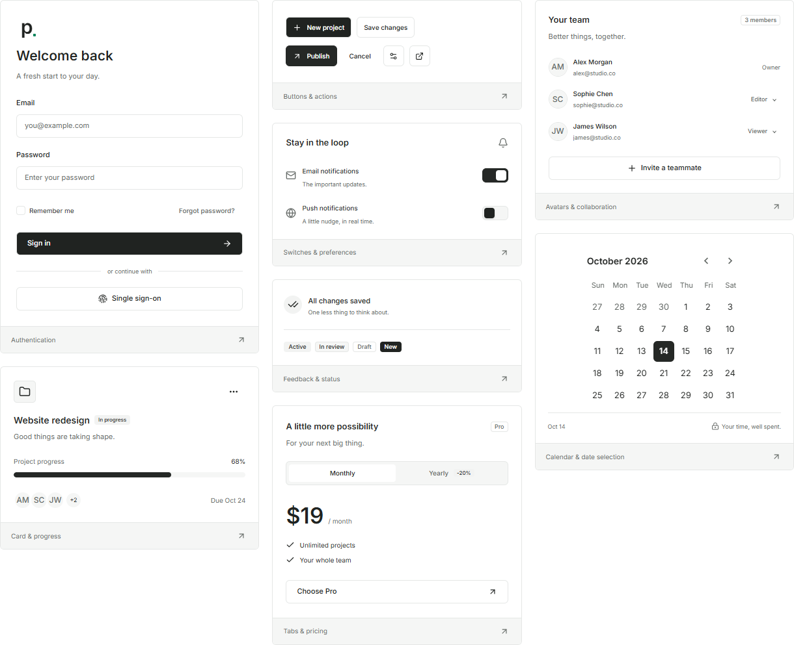

<h1 align="center">
  <picture>
    <source media="(prefers-color-scheme: dark)" srcset="docs/assets/readme/logo-dark.png" />
    
  </picture>
</h1>

<p align="center"><strong>Plain by default. Yours by design.</strong></p>
<p align="center">A composable React component library. Minimal defaults, expressive APIs, room for your own design.</p>

<p align="center">
  <a href="https://github.com/ayhamDev/Plain/actions/workflows/ci.yml"></a>
  <a href="LICENSE"></a>
  <a href="packages/ui/package.json"></a>
  <a href="packages/ui/package.json"></a>
</p>

<p align="center">
  <a href="#getting-started">Get Started</a> &middot;
  <a href="#components">Components</a> &middot;
  <a href="#documentation">Documentation</a> &middot;
  <a href="packages/ui/CHANGELOG.md">Changelog</a> &middot;
  <a href="CONTRIBUTING.md">Contributing</a>
</p>

<picture>
  <source media="(prefers-color-scheme: dark)" srcset="docs/assets/readme/preview-dark.png" />
  
</picture>

Real components from the documentation app, in light and dark. Application content is illustrative; authentication and billing are not connected services.

## Why P.UI?

- **Considered defaults.** A quiet, neutral light/dark palette, consistent spacing, and restrained borders. Brand color generation is opt-in.
- **Your design, your controls.** Semantic CSS tokens, typed styling slots, scoped themes, native classes, and an unstyled mode.
- **Composition over lock-in.** Native props and refs, controlled state, compound components, and customizable rendering where it matters.
- **Interaction built in.** Keyboard navigation, focus handling, form semantics, and reduced-motion support in the component implementations.
- **Localizable interfaces.** English and Arabic dictionaries, typed translation overrides, locale formatting, and RTL support.
- **More than primitives.** Tables, scheduling, charts, search, resizable layouts, virtualization, and Kanban, with dedicated entry points.
- **Inspectable examples.** Versioned documentation with live previews, API references, prop workbenches, and copyable TSX.

No Tailwind installation, downloaded font, or application framework is required to use the compiled styles. P.UI targets React DOM web applications, not React Native.

## Getting Started

> **Release status:** `@plain/ui` is versioned at **0.2.0** and currently distributed as a local package archive. It is not published to npm. Build an archive from this checkout using the workflow below; upcoming package changes are tracked with [Changesets](docs/releases/README.md).

**Requirements:** React and React DOM **18.3 or 19**. For repository development and packing, use **Node 24.13.0** and **npm 11.6.2**, as pinned in [`.node-version`](.node-version) and [`package.json`](package.json).

Build the package:

```sh
git clone https://github.com/ayhamDev/Plain.git
cd Plain
npm ci
npm run pack:ui
```

Then install the generated archive in your React application, replacing the path with your checkout location:

```sh
npm install /path/to/Plain/apps/docs/public/plain-ui-0.2.0.tgz
```

The package ships ESM modules, TypeScript declarations, and explicit CSS exports. Install from the archive, not the private workspace root.

### Quick Start

Import the stylesheet once and put `PlainProvider` at your application root:

```tsx
import { Button, Field, Input, PlainProvider } from '@plain/ui';
import '@plain/ui/styles.css';

export default function App() {
  return (
    <PlainProvider>
      <form
        onSubmit={(event) => event.preventDefault()}
        style={{ display: 'grid', gap: 16, maxWidth: 360 }}
      >
        <Field label="Project name" description="Visible to your team." required>
          <Input name="project" placeholder="Website redesign" required />
        </Field>
        <Button type="submit">Create project</Button>
      </form>
    </PlainProvider>
  );
}
```

`Field` associates its label, description, and error with one focusable control. For a compound `Select`, wrap `SelectTrigger` in `Field`, not the non-DOM `Select` root. Your application owns submission, data, and server-side validation.

## Components

| Area                        | Included                                                                                                                |
| --------------------------- | ----------------------------------------------------------------------------------------------------------------------- |
| Actions and feedback        | Buttons, toggles, chips, badges, alerts, avatars, progress, loading, and empty states                                   |
| Forms                       | Inputs, textarea, select, combobox, checkbox, radio, switch, slider, color, file, number, password, PIN, and tags       |
| Date and time               | Calendar, date/time pickers, ranges, and timezone-aware validation                                                      |
| Navigation and overlays     | Sidebar, bottom navigation, tabs, breadcrumb, pagination, stepper, tree view, dialog, sheet, drawer, menus, and popover |
| Layout and data             | Layout primitives, Resizable, ScrollArea, Table, DataTable, virtual lists, grids, and masonry                           |
| Visualization and workflows | Area, bar, line, donut, pie, radar, scatter, composed, heatmap, Gantt, full calendar, Kanban, and search views          |

Use the core package for everyday components. Charts, full-calendar scheduling, Kanban, and the optional Motion wrapper are **not** exported from the core barrel:

| Import                    | Purpose                                                                 | Styles                               |
| ------------------------- | ----------------------------------------------------------------------- | ------------------------------------ |
| `@plain/ui`               | Core components, providers, styling utilities, and typography           | `@plain/ui/styles.css`               |
| `@plain/ui/data-table`    | Typed filters, sorting, selection, pagination, and remote-table helpers | Core stylesheet                      |
| `@plain/ui/layout`        | Responsive layout primitives and Resizable panels                       | Core stylesheet                      |
| `@plain/ui/sidebar`       | AppShell, composable sidebars, navigation, and step flows               | Core stylesheet                      |
| `@plain/ui/date-time`     | Time, date-time, and range controls                                     | Core stylesheet                      |
| `@plain/ui/charts`        | Chart components, heatmap, and Gantt                                    | Core + `@plain/ui/charts.css`        |
| `@plain/ui/full-calendar` | Scheduler and composable event dialog                                   | Core + `@plain/ui/full-calendar.css` |
| `@plain/ui/kanban`        | Controlled lanes, drag-and-drop, and keyboard move actions              | Core stylesheet                      |
| `@plain/ui/search-view`   | Docked, modal, and fullscreen search                                    | Core stylesheet                      |
| `@plain/ui/motion`        | Lazy MotionProvider, Motion, Presence, and presets                      | No additional CSS                    |

Additional public entry points cover primitives, forms, overlays, navigation, calendar, command, table, advanced controls, virtualization, typography, i18n, chips, theme, tokens, styling, color generation, and component extension. See the [export map](packages/ui/package.json).

Dependencies are externalized and modules are tree-shakeable. Your imports and bundler determine browser bundle size; installation size is not a bundle-size promise.

## Customization

Start neutral. Introduce a brand deliberately:

```tsx
import { Button, PlainProvider } from '@plain/ui';

export function BrandedAction() {
  return (
    <PlainProvider
      persist={false}
      theme={{ mode: 'system', color: '#087f5b', radius: 6, borders: 'subtle' }}
      tokens={{ 'button.radius': '4px' }}
    >
      <Button variant="accent">Publish project</Button>
    </PlainProvider>
  );
}
```

A seed color generates paired light/dark roles. Without a seed or colored preset, the original neutral palette is preserved. `persist={false}` uses the supplied settings without loading stored user preferences.

- **Tokens:** override semantic roles or individual component aliases.
- **Scopes:** use `ThemeScope` for local tokens, direction, and scoped portals.
- **Parts:** apply typed slot classes with `styles` or `StyleProvider`; use native `className` and `style` for local changes.
- **Variants:** compose typed defaults and variants with `extendComponent`.
- **Unstyled:** retain primitive semantics and behavior while supplying your own complete visual treatment.

Custom styles still need usable focus indicators, target sizes, and foreground/background contrast. The live documentation includes theming, design-token, customization, and motion guides.

### Localization and RTL

`LanguageProvider` supplies built-in strings, date/number formatting, and typed overrides. Set document `lang` and direction at your application boundary; application text and data remain yours to translate.

```tsx
import { Calendar, LanguageProvider, PlainProvider } from '@plain/ui';

export function LocalizedCalendar() {
  return (
    <PlainProvider dir="rtl">
      <LanguageProvider locale="ar-EG" timeZone="Africa/Cairo">
        <Calendar mode="single" />
      </LanguageProvider>
    </PlainProvider>
  );
}
```

Use `messages` for individual string overrides and `translations` for additional locale dictionaries. `TranslationProvider` is an alias of `LanguageProvider`.

## Documentation

Run the interactive documentation from the repository root:

```sh
npm run dev
```

Open [localhost:5173](http://127.0.0.1:5173). Component pages include previews, matching code, API tables, accessibility notes, and prop controls. Guides cover installation, theming, localization, data tables, scheduling, motion, and more.

Documentation follows `@plain/ui` versions. Historical releases use their own implementation, dependencies, examples, and downloads rather than current components under an old label. The current version tracks the checkout until frozen. See the [version registry](docs/versions.json) and [archive workflow](docs/versions/README.md). The 0.1 history uses the original `@plainui/react` package name.

| Resource                                    | What you will find                                     |
| ------------------------------------------- | ------------------------------------------------------ |
| [UI changelog](packages/ui/CHANGELOG.md)    | Package changes and migration notes                    |
| [Release workflow](docs/releases/README.md) | Independent versioning, validation, and distribution   |
| [Monorepo guide](docs/monorepo.md)          | Package ownership, dependencies, and workspace tooling |
| [QA record](QA.md)                          | Verified checks and remaining limitations              |
| [Contributing](CONTRIBUTING.md)             | Development conventions and changeset requirements     |

The blocks and templates collections are intentionally empty while they are rebuilt. Future compositions will be application-owned copy/paste source, not library exports.

## Monorepo

```text
Plain/
  apps/docs/       Private documentation app and browser tests
  packages/ui/     @plain/ui source, exports, tests, and changelog
  tooling/         Shared build, TypeScript, and test configuration
  scripts/         Workspace checks, scaffolding, and package verification
  .changeset/      Independent package release plans
```

npm workspaces share one root lockfile. Turborepo orders builds and caches tasks; boundary checks prevent private source imports, undeclared workspace dependencies, and dependency cycles.

New packages are scaffolded with `npm run create:package -- <name>`; add `--react` for React packages. A future `@plain/icon` can live alongside `@plain/ui` and release independently. Scaffolds stay private until their implementation and tests are ready; an icon package is **not shipped yet**.

### Development Commands

| Command                  | Purpose                                                    |
| ------------------------ | ---------------------------------------------------------- |
| `npm ci`                 | Install all workspaces from the root lockfile              |
| `npm run dev`            | Start the documentation development server                 |
| `npm run build`          | Build packages and versioned documentation                 |
| `npm run typecheck`      | Check workspace TypeScript                                 |
| `npm run lint`           | Lint source and validate workspace boundaries              |
| `npm run format:check`   | Check formatting                                           |
| `npm test`               | Run infrastructure, library, and documentation unit tests  |
| `npm run test:e2e`       | Run Playwright browser tests                               |
| `npm run verify:package` | Verify packed consumers, public examples, and tree shaking |
| `npm run release:status` | Inspect the Changesets release plan                        |

On Windows, use `npm.cmd` if PowerShell blocks `npm.ps1`. CI is configured to run package checks on Linux and Windows, plus Chromium browser tests. See the [workflow](.github/workflows/ci.yml); the badge above reports its actual remote status.

Automated accessibility checks are not a WCAG certification. Applications still need assistive-technology, device, security, and backend testing. Validation evidence is recorded in [QA.md](QA.md) and the [release records](docs/releases/README.md).

## Contributing

[Bug reports](https://github.com/ayhamDev/Plain/issues), focused improvements, and documentation fixes are welcome. Read [CONTRIBUTING.md](CONTRIBUTING.md), include a reproducible example when reporting a bug, and add a Changeset for consumer-visible package changes. Publishing packages and deploying the docs are explicit release operations, not automatic consequences of a merge.

## License

P.UI is [MIT licensed](LICENSE). Created and maintained by [Ayham](https://github.com/ayhamDev).
